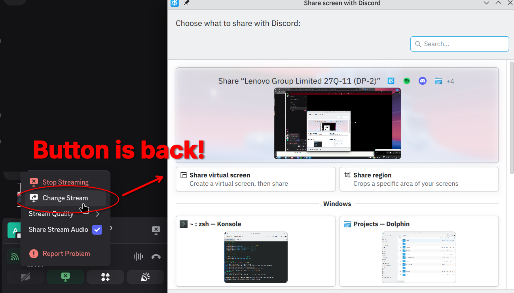
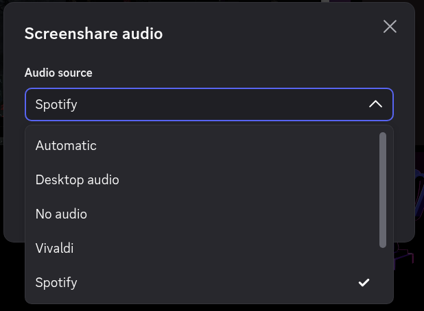

# Equicord Screenshare

Share application audio and switch windows without restarting your Discord stream. For official Discord on Linux Wayland, tested on KDE with PipeWire.





## Install

Open a terminal and paste:

```bash
curl -fsSL https://raw.githubusercontent.com/aliveoutside/equicord-screenshare/main/setup.sh | bash
```

Everything is downloaded and built for you. It can take a few minutes and may ask for your password to install build tools. Run it without `sudo`.

**Already using Equicord?** This installer replaces the build Discord loads with Equicord plus this plugin. You no longer need to build or update your old copy separately. Use the update command below from now on.

When it finishes, **quit Discord completely, including the tray icon, and reopen it**.

The installer supports Arch/CachyOS, Debian/Ubuntu and Fedora on x64. Launch Discord at least once before installing. Flatpak and Snap installs aren't supported. This installs Equicord and replaces any existing Discord mod installation.

## Update

```bash
~/.local/bin/equicord-screenshare update
```

Restart Discord afterward.

## Uninstall

```bash
~/.local/bin/equicord-screenshare uninstall
```

Removes Equicord from Discord. Downloaded files stay so you can reinstall later.

## OpenAsar

Optional, using the official Equicord installer:

```bash
~/.local/bin/equicord-screenshare install-openasar
~/.local/bin/equicord-screenshare uninstall-openasar
```

OpenAsar is managed separately; uninstalling Equicord leaves it installed. Restart Discord after either action.

## Use

Start a screenshare with **Sound** enabled. Audio is selected automatically when your app or monitor is recognized. Otherwise, the picker opens so you can select an application, desktop audio, or use **Identify window audio** on KDE.

Use **Change Windows** in Discord's stream menu to switch the shared window or monitor. You can reopen the audio picker from plugin settings or Toolbox.

Still experimental. Discord updates can break the native hook, and EasyEffects routing and GPU capture have had problems during testing.

GPL-3.0-or-later. See [LICENSE](LICENSE).
